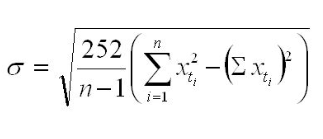
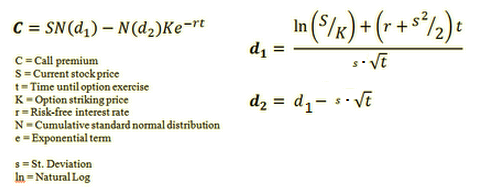
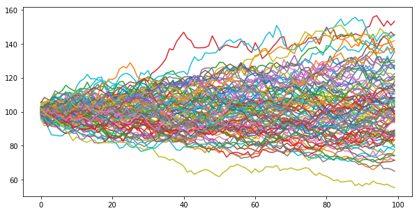
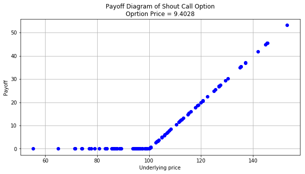

### Traditional Historical Volatility Calculation


```python
# -*- coding: utf-8 -*-
# @Author: boyac
# @Date:   2016-05-02 18:28:28
# @Last Modified by:   boyac
# @Last Modified time: 2016-05-02 19:09:29

from pandas import np
import pandas_datareader.data as web

def historical_volatility(sym, days): # stock symbol, number of days
    "Return the annualized stddev of daily log returns of picked stock"
    try:
        # past number of 'days' close price data, normally between (30, 60)
        quotes = web.DataReader(sym, 'yahoo')['Close'][-days:] 
    except Exception, e:
        print "Error getting data for symbol '{}'.\n".format(sym), e
        return None, None
    logreturns = np.log(quotes / quotes.shift(1))
    # return square root * trading days * logreturns variance
    # NYSE = 252 trading days; Shanghai Stock Exchange = 242; Tokyo Stock Exchange = 246 days?
    return np.sqrt(252*logreturns.var()) 
    
    
if __name__ == "__main__":
    print historical_volatility('FB', 30) # facebook: 0.296710526109
```


### Garman-Klass Historical Volatility

```python
# -*- coding: utf-8 -*-
# @Author: boyac
# @Date:   2016-05-02 18:28:28
# @Last Modified by:   boyac
# @Last Modified time: 2016-05-02 19:09:29

from pandas import np
import pandas_datareader.data as web


def gk_vol(sym, days):
    """"
    Return the annualized stddev of daily log returns of picked stock
    Historical Open-High-Low-Close Volatility: Garman Klass
    sigma**2 = ((h-l)**2)/2 - (2ln(2) - 1)(c-o)**2
    ref: http://www.wilmottwiki.com/wiki/index.php?title=Volatility
    """

    try:
    	o = web.DataReader(sym, 'yahoo')['Open'][-days:] 
    	h = web.DataReader(sym, 'yahoo')['High'][-days:] 
    	l = web.DataReader(sym, 'yahoo')['Low'][-days:] 
        c = web.DataReader(sym, 'yahoo')['Close'][-days:]
    except Exception, e:
        print "Error getting data for symbol '{}'.\n".format(sym), e
        return None, None
    sigma = np.sqrt(252*sum((np.log(h/l))**2/2 - (2*np.log(2)-1)*(np.log(c/o)**2))/days)
    return sigma
    
    
if __name__ == "__main__":
    print gk_vol('FB', 30) # facebook: 0.223351260219
```


### Black-Scholes Model

```python
# -*- coding: utf-8 -*-
# @Author: boyac
# @Date:   2016-05-02 18:28:28
# @Last Modified by:   boyac
# @Last Modified time: 2016-05-04 00:27:52

from __future__ import division
from scipy.stats import norm
from math import *

# Cumulative normal distribution
def CND(X):
    return norm.cdf(X)

# Black Sholes Function
def BlackScholes(CallPutFlag,S,K,t,r,s):
    """
    S = Current stock price
    t = Time until option exercise (years to maturity)
    K = Option striking price
    r = Risk-free interest rate
    N = Cumulative standard normal distribution
    e = Exponential term
    s = St. Deviation (volatility)
    Ln = NaturalLog
    """
    d1 = (log(S/K) + (r + (s ** 2)/2) * t)/(s * sqrt(t))
    d2 = d1 - s * sqrt(t)

    if CallPutFlag=='c':
        return S * CND(d1) - K * exp(-r * t) * CND(d2) # call option
    else:
        return K * exp(-r * t) * CND(-d2) - S * CND(-d1) # put option 


if __name__ == "__main__":
    # Number taken from: http://wiki.mbalib.com/wiki/Black-Scholes期权定价模型
    print BlackScholes('c', S=164.0, K=165.0, t=0.0959, r=0.0521, s=0.29) # 5.788529972549341
```

### Exotic Options Example: Shout Options by Monte Carlo Approximation



